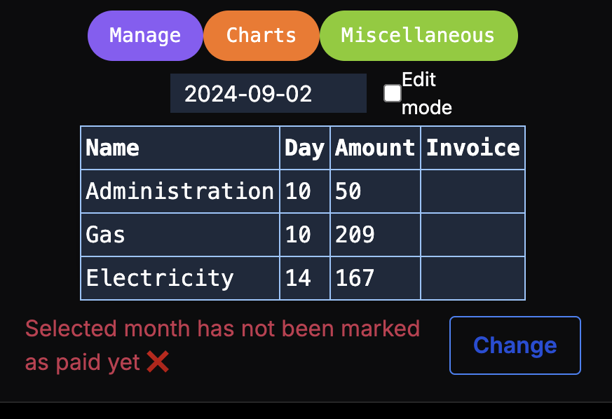

# Rozrachunki

## Description

NextJS web application using a Firebase database, which stores information about various monthly bills and subscriptions, both constant and various per month.

Each bill has following fields:  
Name, monthly or bimonthly, fixed due time, fixed amount.  
Each month has following fields regarding every saved bill identified by its name:  
Due time, amount, attached file

## Demo

Visit [production url](https://rozrachunki.vercel.app) and login using following account details:  
Login: demo@user.com  
Password: demoUser

## Installation

[Open instructions](INSTALLATION.md)
